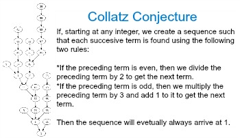

# Week 9 Lesson 3 Developing Algorithms

## "What Will we Learn in this Lesson?"

 - For Algorithms
    - How to combine and/or modify an existing algorithm.

- Benefits of combining algorithms
    - can reduce development time, testing time, and simplify the identification of errors.

# Example in Class

## Rules

- step/rule 1: start with any positive integer
- step/rule 2: if the preceding term is even; divide by 2
- step/rule 3: if the preceding term is odd; multiply by 3 and add 1
- step/rule 4: repeat steps until you arrive at 1
- fact: the sequence should ALWAYS end up at 1 if repeated.

## Algorithm to Start (Determining Whether a Number is Even or Odd);

display("choose value for x")

x <- input()

if(n mod2 = 0)

{
    Display ("n is even")
}

ELSE

{
    Display ("n is odd")
}

## how can we modify this code to match our goal

- Hint: uses arithmetic operations
- Hint: look at the steps of the equation and try and modify it to fit them
- Must display all numbers used in it

# Solution

## Step 1
- adding steps 2 and 3 from the original equation

display("choose value for x")

x <- input()

if(x mod 2 = 0)
{
    x <- n/2  # right here
}
ELSE
{
    x <- n * 3 + 1 .     # and here
}

## Step 2 

- step/rule 4; here we add the loop

display("choose value for x")

x <- input()
Repeat until (n=1)   # Right here
{
if(x mod 2 = 0)
{
    x <- n/2
}
ELSE
{
    x <- n * 3 + 1
}
}

## Final Step/Step 3

- Displaying all numbers in the sequence

display("choose value for x")

x <- input()
Display(x)
Repeat until (n=1)
{
if(x mod 2 = 0)
{
    x <- n/2
}
ELSE
{
    x <- n * 3 + 1
}
Display(n)
}

## Takeaways

- You can use code you've previously wrote in order to make a project easier.
- Breaking algorithms down into steps can make things easier and more simple.

# Hacks

- create another algorithm using a famous mathematical algorithm such as the "collatz conjecture." and explain your steps in a post on a blog.

